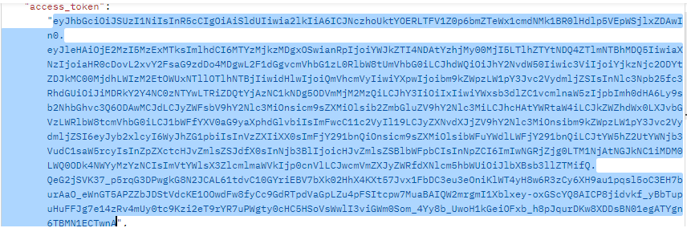
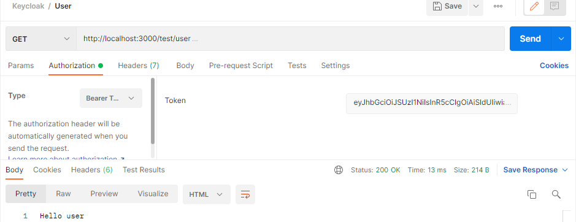

# Prueba en Postman
- Probando la ruta de Anonymous, no necesita de ningún tipo de rol o aunque tenga rol de usuario y admin, es un usuario que tiene token y va a recibir Hello Anonymous. Ver figura 15, 16 y 17.

                                                         Figura 15.
                                              Inicio de sesión con Empleado 1.
                                             
            

                                                         Figura 16.
                              Token obtenido del Empleado 1 y lo enviamos a la ruta de Anonymous.
                              

                                                         
                                                         Figura 17.  
                      Pego el Token del Empleado 1 en la ruta de Anonymous y nos muestra “Hola Anonymous”.
                      
                      
- Probamos la ruta de User, este en la configuración de Keycloak le asignamos solamente el rol de usuario. Ver figura 18.
                                             

                                                         Figura 18.
                    Pego el mismo token obtenido anteriormente del Empleado 1,  me devuelve “Hello User”, 
                 significa que el Empleado 1 tiene rol de usuario y por lo tanto puede acceder a esta ruta.
                 
                 
- Probamos la ruta de Admin, este en la configuración de Keycloak le asignamos el rol de administrador. Ver figura 19.

                                                          Figura 19. 
                Pego el token del Empleado 1,  me devuelve “Access denied”, significa que el Empleado 1 no 
                tiene rol de administrador sino rol de usuario, por lo tanto no puede acceder a esta ruta.
                
                

                                                          Figura 20.
                Pego el token del Empleado 1,  me devuelve “Hello all user”, significa que el Empleado 1 si 
               puede acceder porque esta ruta  tiene 2 roles, usuario y administrador, por lo tanto si puede 
                                                     acceder a esa ruta.
                                                     
                                                     
- Login con Empleado 2 y probamos la ruta de User. Ver figura 21, 22 y 23.

                                                          Figura 21.
                                                Inicio de sesión con Empleado 2.
                                                
    

                                                          Figura 22.
                                Token obtenido del Empleado 2 y lo enviamos a la ruta de User.
                                

                                                          Figura 23.
                 Pego el token del Empleado 2 en la ruta de User,  me devuelve Access denied, significa que el 
                  Empleado 2 tiene rol de administrador y no de usuario, por lo tanto no puede acceder a esta 
                                                             ruta.
                                                             

- Probamos la ruta de Admin, este en la configuración de Keycloak le asignamos el rol de administrador. Ver figura 24.

                                                          Figura 24. 
                  Pego el token del Empleado 2 en la ruta de Admin,  me devuelve “Hola admin”, significa que el 
                          Empleado 2 tiene rol de administrador, por lo tanto puede acceder a esta ruta.
                          
                          
- Probamos la ruta de All User, este en la configuración de Keycloak le asignamos el rol de usuario y administrador. Ver figura 25.

                                                          Figura 25.
                   Pego el token del Empleado 2,  me devuelve “Hello all user”, significa que el Empleado 2 si 
                   puede acceder porque esta ruta  tiene 2 roles, usuario y administrador, por lo tanto si puede 
                                                      acceder a esa ruta.
                                                      
                                                      
- Login con Empleado 3 y probamos la ruta de User. Ver figura 26, 27 y 28.

                                                           Figura 26.
                                               Inicio de sesión con Empleado 3.
                                               

                                                           Figura 27.
                                Token obtenido del Empleado 3 y lo enviamos a la ruta de User.
                                

                                                           Figura 28.
                   Pego el token del Empleado 3 en la ruta de User,  me devuelve “Hello user”, significa que el 
                             Empleado 3 tiene rol de usuario, por lo tanto puede acceder a esta ruta.
                             
                             
- Probamos la ruta de Admin, este en la configuración de Keycloak le asignamos el rol de administrador. Ver figura 29.

                                                           Figura 29. 
                   Pego el token del Empleado 3 en la ruta de Admin,  me devuelve “Hola admin”, significa que el 
                             Empleado 3 tiene rol de administrador, por lo tanto puede acceder a esta ruta.
                             
                             
- Probamos la ruta de All User, este en la configuración de Keycloak le asignamos el rol de usuario y administrador. Ver figura 30.

                                                           Figura 30.
                   Pego el token del Empleado 3,  me devuelve “Hello all user”, significa que el Empleado 3 si 
                   puede acceder porque esta ruta  tiene 2 roles, usuario y administrador, por lo tanto si puede 
                                                       acceder a esa ruta.

